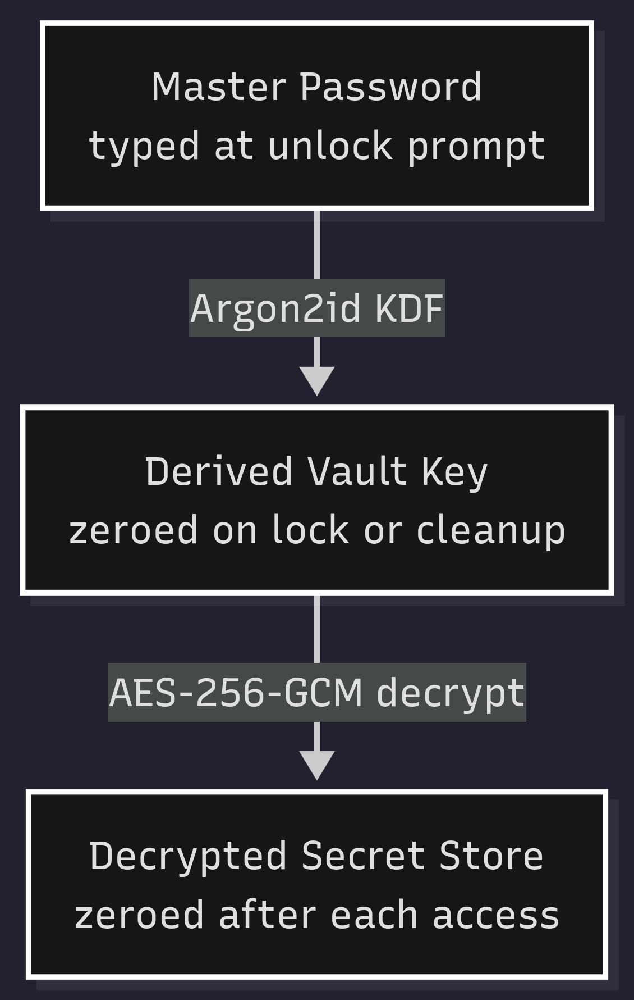
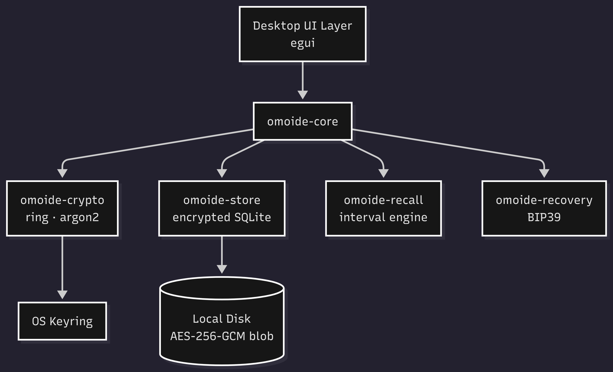

# Omoide — Recall-Focused Password Manager

> Omoide (思い出, Japanese: *memory/recollection*) is an open-source, desktop-only password manager built in Rust. It enforces active recall of your master password, uses zero-network architecture, and gives you a cryptographic escape hatch — all without trusting any cloud.

---

## Why Omoide?

Most password managers treat memory as a liability — they autofill everything so you never have to think. Omoide treats memory as **muscle memory**. The more you exercise it, the stronger your posture becomes. Combined with a fully air-gapped architecture and hardware-safe memory handling in Rust, Omoide is designed for users who want real and local ownership of their credentials.

---

## Features

| Feature | Description |
|---|---|
| **Encrypted Vault** | AES-256-GCM encryption at rest via `aes-gcm` |
| **Recall Mode** | Periodically prompts you to re-enter your master password. Incorrect guesses shorten the re-prompt interval — training memory, penalising complacency |
| **Emergency Recovery** | Optional BIP39 12-word seed phrase for vault recovery. **Never written to disk** |
| **Auto-Clear Clipboard** | Copied passwords are zeroed from the clipboard after 8 seconds |
| **Local-Only** | Zero network I/O. Your vault never leaves your machine |
| **Memory-Safe Secrets** | Secrets are held in manually managed memory regions and explicitly zeroed on drop via `zeroize` crate — uses compiler fence to confirm zeroization |

---

## Security Model

### Cryptographic Primitives

| Layer | Algorithm | Library | Rationale |
|---|---|---|---|
| **Vault Encryption** | AES-256-GCM | `aes-gcm` | AEAD; provides both confidentiality and integrity |
| **Key Derivation** | Argon2id | `argon2` | Memory-hard (64 MB, 4 iterations, per-vault salt); resists GPU/ASIC brute-force |
| **Secret Erasure** | zeroing via `zeroize` | `zeroize` crate | Prevents compiler from optimising out zeroing of sensitive stack/heap values |
| **Recovery** | BIP39 (128-bit entropy) | `bip39` | Industry-standard; 12-word phrase maps deterministically to vault key |

### Threat Model

Full STRIDE analysis, asset register, and non-negotiable security rules live in **[THREAT_MODEL.md](docs/THREAT_MODEL.md)**.

### Memory Safety Architecture

---

## Recall Mode

Recall Mode is Omoide's differentiating feature. Rather than a passive auto-lock timer, it is an **active re-entry enforcement system**:

1. After a configurable idle period, Omoide overlays a re-entry prompt.
2. Each **correct** entry resets the timer and slightly extends the next interval (up to a ceiling).
3. Each **incorrect** entry halves the next re-prompt interval — down to a minimum floor — and increments a local strike counter.
4. The strike counter is persisted in the vault header (plaintext metadata only; entry content remains encrypted) so rebooting does not reset it.

This creates a continuous, low-friction spaced-repetition loop for your master password — the same cognitive mechanism used in language learning and flashcard systems like Anki Flashcards.

---

## Installation

> **Status: Pre-release.** Binaries are not yet available. See [Roadmap](#roadmap).

### Supported Platforms

| Platform | Linux | Status |
|---|---|---|
| Windows 10/11 | x86_64 | Planned |
| macOS 13+ | x86_64 / ARM64 | Planned |
| Linux (glibc 2.31+) | x86_64 | Planned |

---

## Architecture

*Workspace Omoide crates are separated by trust boundary (e.g. `omoide-crypto` never depends on `omoide-format`).*

---

## Roadmap

| Milestone | Target | Status |
|---|---|---|
| Core crypto primitives + vault format | 2026-03 | Completed |
| Recall Mode engine | 2026-04 | Completed |
| Desktop UI (egui prototype) | 2026-05 | Planned |
| BIP39 recovery flow | 2026-06 | Planned |
| Security audit + hardening | 2026-07 | Planned |
| **v0.1.0 Release** | **2026-07-30** | Planned (**Target**) |

---

## License

[MIT](LICENSE)